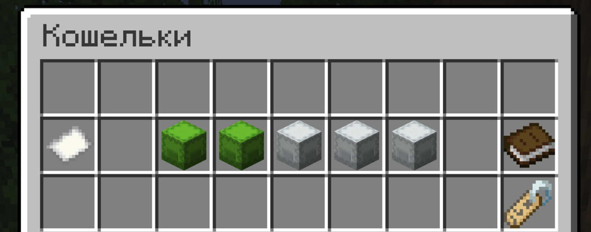

# 🚛 Фишки

## Мир ферм

Сервер разделён на две части - мир построек и мир ферм. Таким образом, мы решили проблему с низким TPS.

Чтобы попасть в мир ферм, постройте портал из 14 малахитовых квамп в такой же форме, как портал в Незер.

Преимущества разделения сервера:

* Лёгкая добыча блоков. Вам не надо подстраиваться под ландшафт
* Ванильные настройки, разрешён дюп ковров, динамита и рельс
* Никаких ограничений на автоматические фермы

## Электронные кошельки

Как карточки на СП, но реализовано иначе. Изначально доступно 2 кошелька, но если вы купите Premium, их будет 5.

Чтобы открыть меню, введите `/wallet`.

<figure><figcaption></figcaption></figure>

## Выпадение голов

При убийстве игрока вы получите его голову (шанс - 5%). Помимо этого, при наведении на голову, будет показано кто и чем убил.

<figure><figcaption></figcaption></figure>

## Кастомные головы

Странствующий торговец может продавать любые виды блоков в виде голов.

<figure><figcaption></figcaption></figure>

## Особые крафты

Блок света - 8 редстоуновых ламп. Получаете 8 блоков света.

* Чтобы сломать блок света, поставьте какой-то другой блок на него
* ПКМ понижает уровень света на одну единицу
* Блок света нейтрален к воде

Мембрана фантома - 8 ниток, 1 алмаз. Получаете 1 мембрану.

* Можно починить элитры
* С помощью грубого зелья можно сделать зелье замедленного падения

Невидимая рамка - 8 обычных рамок. Получаете 8 невидимых рамок.

* Хорошее применение для декора
* Невидимость рамки появляется только тогда, когда в рамке есть объект

## Центральное бюро безопасности

Сокращённо - ЦББ. Это игроки, которые заботятся о вашей безопасности и имеют доступ к логам сервера и другим, дополнительным действиям. Выдают штрафы и предупреждения.

Если хотите обратиться - напишите `/call` в Discord и напишите текст обращения.

## Чат

Восклицательный знак перед сообщением - вы пишите в глобальный чат. Это сообщение увидят все, включая людей, находящихся в другом мире.

`/do` - роле-плей действие. Радиус отображения - 25 блоков.

`/try` - роле-плей действие. Радиус отображения - 25 блкоов. После написания есть 3 исхода: действие совершено, действие почти совершено и действие неудачно.

`/coin` - роле-плей действие. Работает на 25 блоков. Подброс монетки (орёл/решка).

## Интерактивная карта

Следите за происходящим на сервере - как строятся города, какие есть биомы и так далее.

Ссылка - [www.map.frogdream.xyz](https://map.frogdream.xyz)

Ссылка на карту мира ферм - [www.farmsmap.frogdream.xyz](https://farmsmap.frogdream.xyz)

<figure><figcaption></figcaption></figure>

## Сезоны

На данный момент у нас первый сезон, открытие сервера произошло 22 октября 2022 года.

## Рекомендуемая сборка

Чтобы скачать, перейдите по [этой ссылке](https://mega.nz/file/d6QzCJoI#bBmuvc\_XHjHy\_DXlrooBLlrIaJ2BtiZyRcxvo5JD3r8).

